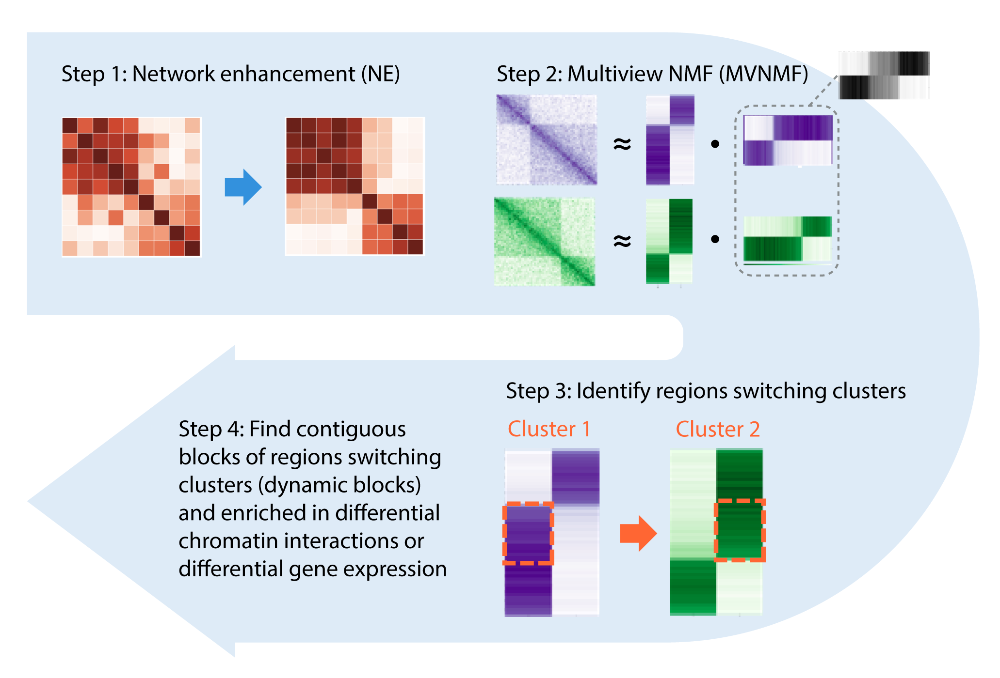

### Multiview NMF (MVNMF) in C++

[](http://perso.crans.org/besson/LICENSE.html)

This implementation of Multiview NMF is part of the NE-MVNMF framework applied to high-throughput chromosome conformation capture (Hi-C) data in order to indentify regions involved in dynamic 3D genome organization during development. Now published in Frontiers in Genetics: https://doi.org/10.3389/fgene.2021.788318



In the the NE-MVNMF framework, network enhancement (NE) first smooths out the input Hi-C matrices representing diffrent biological contexts or conditions. Then MVNMF is applied to jointly factor the matrices. By clustering the factor matrices, regions that are switching cluster assignments across conditions. These contiguous blocks of such regions represent domain-level changes which we call “dynamic blocks.” On the dynamic blocks, we do downstream analysis, such as check for association with differential chormatin interactions or differentially expressed genes.

### [Step 1] Install 

Installation instructions below were tested in Linux Centos 7 distribution. [GSL (GNU Scientific Library) 2.6](https://www.gnu.org/software/gsl/doc/html/index.html) is used to handle matrix- and vector-related operations. For matrix inversion, one of the newer functions in GSL 2.6 is used, so the code may not run if you have an older GSL.

1. __If you already have GSL 2.6 installed__, edit the first few lines of the Makefile to point to the correct include and shared library directory, then jump to step 3.
```
#CHANGE PATHS AS NEEDED:
INCLUDE_PATH = ${CONDA_PREFIX}/include
LIBRARY_PATH = ${CONDA_PREFIX}/lib
```
2. __If you do not have GSL 2.6 installed, or you are not sure__, one way to get it installed is to use [conda](https://anaconda.org/conda-forge/gsl/):
```
conda install -c conda-forge gsl
```
3. Make sure to add the location of the installed shared library to where the compiler/linker will be looking. If you used conda to install GSL to the default location in step 2, run the following command after activating the appropriate environment (or add the appropriate path if you already have GSL installed):
```
export LD_LIBRARY_PATH=${LD_LIBRARY_PATH}:${CONDA_PREFIX}/lib
```
4. And let's install! In the same directory you downloaded the code/Makefile (either by cloning the repository or by downloading a release), run:
```
make run_mvnmf
```
5. If all went well, you won't get any alarming messages, and you will see an executable named `run_mvnmf` created in the same directory. A quick test below will print the manual for running TGIF:
```
./run_mvnmf -h
```

Note: in order to implement NNDSVD initialization of factors, a fast randomized SVD algorithm from [RSVDPACK](https://github.com/sergeyvoronin/LowRankMatrixDecompositionCodes) was used. A minor modification to allow random seed specification was made to the original code from [RSVDPACK](https://github.com/sergeyvoronin/LowRankMatrixDecompositionCodes/tree/master/single_core_gsl_code). This updated code is included under modules/random_svd directory. Compilation of this code is part of the included Makefile; no additional step is necessary for installation.

### [Step 2] Run

#### Basic usage
```
./run_mvnmf input/toy_tree.txt 120 2 -o output/
```
- `input/toy_tree.txt` specifies the tree file, which contains file locations to individual task matrices (paths are relative to location of run_mvnmf executable location). 
- `120` is the number of features/columns in each task matrix, which has to be be the same across all tasks. This current version assume a symmetric matrix.
- `2` = k, the smaller dimensions of U and V. 
-	`-o output/` will put all output files to output/ directory. Check out the example output directory in the repo.
-	`-a 10` will set the alpha (strength of regularization to parent node) to be 10. Default is alpha = 1.


#### Input tree file format
See example in `input/toy_tree.txt`:
```
1	3	A	input/toy/A.txt	120
2	3	B	input/toy/B.txt 120
3	-1	root	N/A	N/A
```
- Column 1: **node ID**; start from 1 and move up.
- Column 2: **parent node ID**; although with MVNMF there will only be one parent node with the consensus factor, we have this place-holder to extend the method with an arbitrary tree structure. Right now the implementation will only work correctly if you ID all children nodes before a parent node (so start from the lowest depth of tree, move to next level, till you hit the root, which should be the last node ID.)
- Column 3: **node alias**, used as prefix to U and V output files.
- Column 4: **location of input matrix file for leaf nodes**, relative to where the run_mvnmf executable is. Set as N/A for non-leaf nodes, i.e. parent node with the consensus factor.
- Column 5: **number of samples/data points/rows in each input matrix**; should be the same as the number of features/columns for now (but in the updated generic version, can differ between each task). Set as N/A for non-leaf nodes.

#### Input matrix file format
- Matrix file, 0-indexed, tab-delimited, sparse-matrix format, no header
- See examples in `input/toy/` directory.
```
0	0	1000.2
0	1	1201.78
10	1	200.7
...
```
